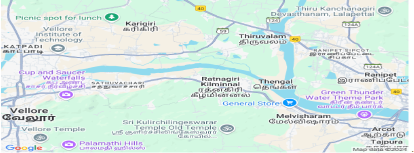

# Ex04 Places Around Me
## Date: 

## AIM
To develop a website to display details about the places around my house.

## DESIGN STEPS

### STEP 1
Create a Django admin interface.

### STEP 2
Download your city map from Google.

### STEP 3
Using ```<map>``` tag name the map.

### STEP 4
Create clickable regions in the image using ```<area>``` tag.

### STEP 5
Write HTML programs for all the regions identified.

### STEP 6
Execute the programs and publish them.

## CODE


```map.html
<html>
<head>
<title>My City</title>
</head>
<body>
<h1 align="center">
<font color="red"><b>Chennai</b></font>
</h1>
<h3 align="center">
<font color="black"><b>Harisha S (24900903)</b></font>
</h3>
<hr size="3" color="red">
<center>

<map name="MyCity">
<area shape="rect" coords="600,120,730,150" href="home.html" title="My Home Town">
<area shape="rect" coords="400,550,460,570" href="temple.html" title="palamathi ">
<area shape="rect" coords="1250,440,1300,660" href="store.html" title="genral store ">
<area shape="rect" coords="750,520,800,550" href="park.html" title="green thunder theme park">
<area shape="rect" coords="1290,280,1330,320" href="vit.html" title="Vellore institute of technology">
</map>
</center>
</body>
</html>


home.html
<html>
<head>
<title>My Home Town</title>
</head>
<body bgcolor="cyan">
<h1 align="center">
<font color="red"><b>Vellore</b></font>
</h1>
<h3 align="center">
    <font color="blue"><b>My Home Town</b></font>
 </h3>
<hr size="3" color="red">
<p align="justify">
<font face="Georgia" size="5">
    Vellore is a city in the state of Tamil Nadu, in southern India.
     It's known for 16th-century Vellore Fort, with its imposing granite walls and surrounding moat.
     Inside the fort, the Jalakandeswarar Temple features many ornate sculptures. 
     Nearby, the Government Museum has prehistoric relics and natural history displays.
      By the Palar River, the Muthu Mandapam memorial houses the tomb of a Tamil leader.
</font>
</p>
</body>
</html>


park.html
<html>
<head>
<title>Fort St.George</title>
</head>
<body bgcolor="pink">
<h1 align="center">
<font color="black"><b>vellore</b></font>
</h1>
<h3 align="center">
    <font color="blue"><b>green thunder theme park
    </b></font>
</h3>
<hr size="3" color="red">
<font face="Georgia" size="5">
    Green Thunder Water Theme Park in Arcot is a popular amusement park offering a variety of water-based attractions,
     including water slides and games. 
    It's known for being a family-friendly destination and a place for recreation and relaxation.
     The park is open 7 days a week and is located on Kanchipuram - Vellore Bypass Road, NH 46.
</p>
</body>
</html>


temple.html
<html>
<head>
<title>Vadapalani Murugan Temple</title>
</head>
<body bgcolor="lightblue">
<h1 align="center">
<font color="red"><b>vellore</b></font>
</h1>
<h3 align="center">
    <font color="blue"><b>palamathi hills
    </b></font>
</h3>
<hr size="3" color="red">
<p align="justify">
<font face="Georgia" size="5">
    Palamathi Hills, part of the Eastern Ghats, are a scenic spot in Vellore, Tamil Nadu, 
    offering a peaceful retreat.
     They are known for their lush greenery, including Palamathi Reserve Forest and Otteri Lake.
      The area is popular for bird watching and offers views of the Vellore countryside.
     A temple dedicated to Lord Muruga is located atop the hill. 
</font>
</p>
</body>
</html>


store.html
<html>
<head>
<title>Valluvar Kottam</title>
</head>
<body bgcolor="lightgreen">
<h1 align="center">
<font color="red"><b>Vellore</b></font>
</h1>
<h3 align="center">
    <font color="blue"><b>genral store
    </b></font>
</h3>
<hr size="3" color="red">
<p align="justify">
<font face="Georgia" size="5">
    A general store, sometimes called a general merchandise store or village shop, is a retail establishment,
     often found in small towns or rural areas, that carries a wide variety of goods.
     These goods might include groceries, household items, clothing, hardware, and more.
      Essentially, it serves as a one-stop shop for the community's general needs. 
</font>
</p>
</body>
</html>


vit.html
<html>
<head>
<title>Fort St.George</title>
</head>
<body bgcolor="pink">
<h1 align="center">
<font color="black"><b>Vellore</b></font>
</h1>
<h3 align="center">
    <font color="blue"><b>vellore institute of technology
    </b></font>
</h3>
<hr size="3" color="red">
<font face="Georgia" size="5">
    ellore Institute of Technology or VIT is a private deemed university in Vellore, Tamil Nadu, India. 
    The institution offers 66 Undergraduate, 58 Postgraduate, 15 Integrated, 2 Research and 2 M.Tech.
     Industrial Programmes
</font>
</p>
</body>
</html>```


## OUTPUT


## RESULT
The program for implementing image maps using HTML is executed successfully.
